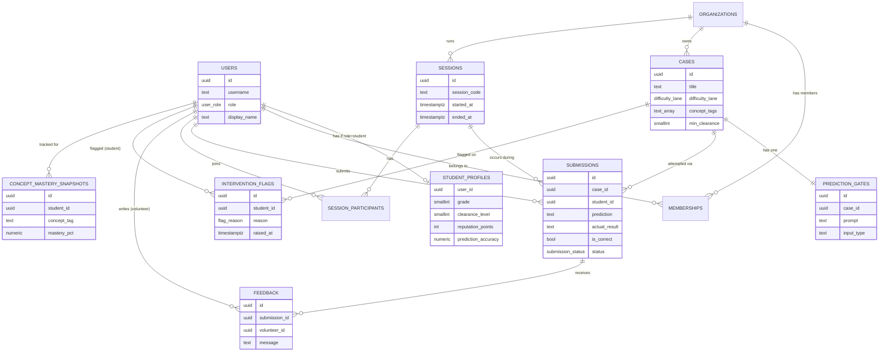
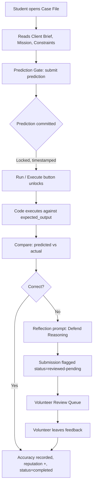
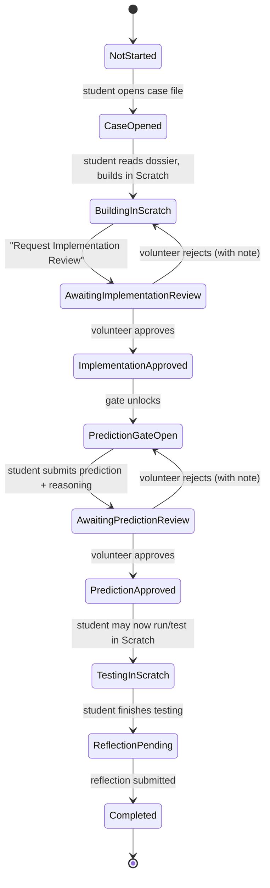

## Merged Files List
- 1. 01-product-spec.md (4.1 KB)
- 2. 02-database-schema.md (8.1 KB)
- 3. 03-architecture-and-roadmap.md (8.9 KB)
- 4. 04-case-state-machine.md (7.4 KB)
- 5. 05-v3-refinement-spec.md (9.2 KB)
- 6. 06-v4-operational-layer.md (22.8 KB)
- 7. 07-v4-5-completion-spec.md (10.3 KB)


## 1. 01-product-spec.md

```md
# SparkCode — Product Specification

## 1. Concept

SparkCode is a coding education platform for grades 3–6, built around a single
pedagogical loop: **Predict → Prove → Execute**. The platform is framed as
"Spark Agency," where students are Junior Developers working through Case
Files (lessons) for client projects. The agency framing is light-touch — it
names things, it doesn't gate the UI behind cartoon characters or arcade
mechanics.

The product's job is to make "thinking before running" the path of least
resistance. Every interaction that leads to code execution must pass through
a prediction first.

## 2. Roles

| Role | Can do |
|---|---|
| Student | Work cases, submit predictions, run code, view own progress |
| Volunteer | Review submissions, give feedback, monitor stuck students |
| Instructor | Author cases, run sessions, view analytics, manage volunteers |
| Administrator | All of the above + user/org management |

Students authenticate with username + password (no email — appropriate for
minors in a supervised nonprofit setting). Instructor-managed rosters create
accounts in bulk.

## 3. The Predict → Prove → Execute Loop

1. **Read Problem** — student opens a Case File, reads the Client Brief,
   Mission, and Constraints.
2. **Predict Outcome** — student writes/selects what they believe the code
   will output or how it will behave. This is the **Prediction Gate**.
3. **Commit Prediction** — submission is timestamped and locked. No edits
   after submission.
4. **Execute** — the Run button only becomes active after a prediction is
   committed.
5. **Compare Result** — platform shows predicted vs. actual side by side and
   computes an accuracy score.
6. **Defend Reasoning** — for misses (or at the instructor's discretion),
   student writes a short reflection on *why* the prediction was wrong. This
   feeds the Volunteer Review Queue.

This loop is the backbone of the data model, the UI, and the analytics
layer — every other module exists to support, surface, or analyze it.

## 4. Core Modules (MVP scope)

1. **Student Dashboard** — clearance level, reputation, prediction accuracy,
   active/completed cases, progress timeline, recent feedback.
2. **Case File System** — case detail view with brief, mission, constraints,
   tools allowed, difficulty lane, developer note, and the Prediction Gate.
3. **Prediction Gate** — the locked prediction → execute → compare → reflect
   flow described above.
4. **Volunteer Review Queue** — list of submissions awaiting review, sorted
   by wait time and priority (stuck students first).
5. **Instructor Dashboard** — live sessions, activity feed, bottlenecks,
   completion rates, accuracy trends.
6. **Analytics Center** — the Learning Evidence Graph (per-concept accuracy
   over time) plus cohort-level trends.
7. **Session System** — instructor generates a session code; students join
   to unlock submission during a workshop window.

## 5. Design Direction

- Palette derived from SparkCode brand blue/orange, neutrals dominate.
- Inspiration: Linear, Notion, Stripe, Headspace — calm, confident,
  professional. Students are treated as capable, not entertained.
- Dark mode is first-class, not an afterthought.
- Motion: subtle only (hover, transitions, progress fill). No confetti, no
  loot-box reveals.
- Gamification is restrained: clearance levels unlock harder cases and
  responsibility (e.g., peer-review eligibility), not cosmetic rewards.

## 6. Non-Goals / Deliberate Simplifications (MVP)

To keep this buildable by a volunteer-run nonprofit team, the MVP explicitly
**excludes**:

- Real-time collaborative code editing (single-student execution only).
- A custom code execution sandbox — MVP uses a third-party sandboxed
  execution API (e.g., Judge0-style) rather than building one.
- In-app messaging/chat between students and volunteers (feedback is
  asynchronous, attached to submissions).
- Public/parent-facing accounts (out of scope for v1; revisit for v2).
- Badge/achievement marketplace — clearance levels are the only
  progression currency.

These can be revisited once the core loop is validated with real cohorts.
```

## 2. 02-database-schema.md

```md
# SparkCode — Database Schema

PostgreSQL-flavored DDL. Naming: snake_case tables/columns, `id` UUID PKs,
`created_at`/`updated_at` timestamps on all tables.

```sql
-- ============================================================
-- USERS & ROLES
-- ============================================================

CREATE TYPE user_role AS ENUM ('student', 'volunteer', 'instructor', 'admin');

CREATE TABLE users (
  id              UUID PRIMARY KEY DEFAULT gen_random_uuid(),
  username        TEXT UNIQUE NOT NULL,
  password_hash   TEXT NOT NULL,
  role            user_role NOT NULL,
  display_name    TEXT NOT NULL,
  created_at      TIMESTAMPTZ NOT NULL DEFAULT now(),
  updated_at      TIMESTAMPTZ NOT NULL DEFAULT now()
);

-- Student-specific profile data
CREATE TABLE student_profiles (
  user_id              UUID PRIMARY KEY REFERENCES users(id) ON DELETE CASCADE,
  grade                SMALLINT NOT NULL CHECK (grade BETWEEN 3 AND 6),
  age                  SMALLINT,
  interests            TEXT[] DEFAULT '{}',
  clearance_level      SMALLINT NOT NULL DEFAULT 1,
  reputation_points    INTEGER NOT NULL DEFAULT 0,
  prediction_accuracy  NUMERIC(5,2) NOT NULL DEFAULT 0.00, -- rolling %
  guardian_contact     TEXT -- optional, for nonprofit ops use only
);

-- Instructor/volunteer org affiliation (multi-tenant: one nonprofit chapter)
CREATE TABLE organizations (
  id    UUID PRIMARY KEY DEFAULT gen_random_uuid(),
  name  TEXT NOT NULL
);

CREATE TABLE memberships (
  user_id UUID REFERENCES users(id) ON DELETE CASCADE,
  org_id  UUID REFERENCES organizations(id) ON DELETE CASCADE,
  PRIMARY KEY (user_id, org_id)
);

-- ============================================================
-- CASE FILES (lessons)
-- ============================================================

CREATE TYPE difficulty_lane AS ENUM ('intro', 'core', 'advanced', 'elite');

CREATE TABLE cases (
  id               UUID PRIMARY KEY DEFAULT gen_random_uuid(),
  org_id           UUID REFERENCES organizations(id),
  title            TEXT NOT NULL,
  client_brief     TEXT NOT NULL,
  mission          TEXT NOT NULL,
  constraints      TEXT,
  tools_allowed    TEXT[] DEFAULT '{}',
  difficulty_lane  difficulty_lane NOT NULL DEFAULT 'core',
  developer_note   TEXT,
  concept_tags     TEXT[] DEFAULT '{}',   -- e.g. {variables, loops}
  starter_code     TEXT,
  expected_output  TEXT,                  -- ground truth for Execute step
  min_clearance    SMALLINT NOT NULL DEFAULT 1,
  created_by       UUID REFERENCES users(id),
  created_at       TIMESTAMPTZ NOT NULL DEFAULT now(),
  updated_at       TIMESTAMPTZ NOT NULL DEFAULT now()
);

-- Each case has exactly one prediction gate configuration
CREATE TABLE prediction_gates (
  id              UUID PRIMARY KEY DEFAULT gen_random_uuid(),
  case_id         UUID UNIQUE REFERENCES cases(id) ON DELETE CASCADE,
  prompt          TEXT NOT NULL,          -- "What will this code print?"
  input_type      TEXT NOT NULL DEFAULT 'free_text', -- free_text | multiple_choice
  choices         JSONB,                  -- for multiple_choice
  requires_reflection_on_miss BOOLEAN NOT NULL DEFAULT true
);

-- ============================================================
-- SESSIONS (live workshops)
-- ============================================================

CREATE TABLE sessions (
  id            UUID PRIMARY KEY DEFAULT gen_random_uuid(),
  org_id        UUID REFERENCES organizations(id),
  instructor_id UUID REFERENCES users(id),
  session_code  TEXT UNIQUE NOT NULL,
  case_ids      UUID[] NOT NULL DEFAULT '{}',
  started_at    TIMESTAMPTZ NOT NULL DEFAULT now(),
  ended_at      TIMESTAMPTZ
);

CREATE TABLE session_participants (
  session_id UUID REFERENCES sessions(id) ON DELETE CASCADE,
  student_id UUID REFERENCES users(id) ON DELETE CASCADE,
  joined_at  TIMESTAMPTZ NOT NULL DEFAULT now(),
  PRIMARY KEY (session_id, student_id)
);

-- ============================================================
-- SUBMISSIONS (the heart of Predict -> Prove -> Execute)
-- ============================================================

CREATE TYPE submission_status AS ENUM (
  'predicted',      -- prediction committed, not yet executed
  'executed',       -- code run, result captured
  'reviewed',       -- volunteer has given feedback
  'completed'       -- student moved on / case closed
);

CREATE TABLE submissions (
  id                  UUID PRIMARY KEY DEFAULT gen_random_uuid(),
  case_id             UUID REFERENCES cases(id),
  student_id          UUID REFERENCES users(id),
  session_id          UUID REFERENCES sessions(id), -- nullable: untimed practice

  -- Predict
  prediction          TEXT NOT NULL,
  prediction_committed_at TIMESTAMPTZ NOT NULL DEFAULT now(),

  -- Execute
  submitted_code      TEXT,
  actual_result       TEXT,
  executed_at         TIMESTAMPTZ,

  -- Compare
  is_correct          BOOLEAN,
  accuracy_score      NUMERIC(5,2), -- 0-100, allows partial credit

  -- Defend
  reflection          TEXT,

  status              submission_status NOT NULL DEFAULT 'predicted',
  created_at          TIMESTAMPTZ NOT NULL DEFAULT now(),
  updated_at          TIMESTAMPTZ NOT NULL DEFAULT now(),

  CONSTRAINT prediction_immutable_after_exec
    CHECK (executed_at IS NULL OR prediction_committed_at <= executed_at)
);

-- ============================================================
-- VOLUNTEER REVIEW & FEEDBACK
-- ============================================================

CREATE TABLE feedback (
  id            UUID PRIMARY KEY DEFAULT gen_random_uuid(),
  submission_id UUID REFERENCES submissions(id) ON DELETE CASCADE,
  volunteer_id  UUID REFERENCES users(id),
  message       TEXT NOT NULL,
  created_at    TIMESTAMPTZ NOT NULL DEFAULT now()
);

CREATE TYPE flag_reason AS ENUM (
  'stuck_10min', 'failed_gate_repeat', 'wrong_prediction_repeat', 'inactive'
);

CREATE TABLE intervention_flags (
  id          UUID PRIMARY KEY DEFAULT gen_random_uuid(),
  student_id  UUID REFERENCES users(id),
  case_id     UUID REFERENCES cases(id),
  reason      flag_reason NOT NULL,
  raised_at   TIMESTAMPTZ NOT NULL DEFAULT now(),
  resolved_at TIMESTAMPTZ,
  resolved_by UUID REFERENCES users(id)
);

-- ============================================================
-- LEARNING EVIDENCE (concept mastery over time)
-- ============================================================

-- Snapshot row per (student, concept, time) — append-only,
-- powers the Learning Evidence Graph
CREATE TABLE concept_mastery_snapshots (
  id          UUID PRIMARY KEY DEFAULT gen_random_uuid(),
  student_id  UUID REFERENCES users(id),
  concept_tag TEXT NOT NULL,         -- 'variables', 'loops', 'conditionals'
  mastery_pct NUMERIC(5,2) NOT NULL, -- 0-100
  recorded_at TIMESTAMPTZ NOT NULL DEFAULT now()
);

CREATE INDEX idx_mastery_student_concept
  ON concept_mastery_snapshots (student_id, concept_tag, recorded_at);

-- ============================================================
-- INDEXES (high-traffic lookups)
-- ============================================================

CREATE INDEX idx_submissions_student ON submissions (student_id, status);
CREATE INDEX idx_submissions_case ON submissions (case_id);
CREATE INDEX idx_cases_concept_tags ON cases USING GIN (concept_tags);
CREATE INDEX idx_flags_unresolved ON intervention_flags (resolved_at) WHERE resolved_at IS NULL;
```

## Notes

- **`prediction_committed_at`** combined with the application-level rule
  "no edits after `executed_at` is set" enforces the lock. The CHECK
  constraint guards against impossible orderings; immutability of the
  `prediction` column itself is enforced at the API layer (no PATCH route
  once `status != 'predicted'`).
- **`concept_mastery_snapshots`** is intentionally append-only and decoupled
  from `submissions` — it's written by a background job that recomputes
  rolling accuracy per concept after each `executed` submission, which keeps
  the Learning Evidence Graph cheap to query (just `ORDER BY recorded_at`).
- **`intervention_flags`** are raised by a scheduled job (stuck >10min,
  repeated gate failures) and consumed by the Volunteer Review Queue.
- Multi-tenancy via `organizations`/`memberships` is included now because
  retrofitting it later is painful, but a single-org deployment can ignore
  it (one row in `organizations`, every user a member).
```

## 3. 03-architecture-and-roadmap.md

```md
# SparkCode — ER Diagram, Frontend Architecture, Roadmap

## 1. Entity Relationship Diagram (Mermaid)



## 2. Primary User Flow — Predict → Prove → Execute



## 3. Page Structure & Navigation

```
/                          → marketing / login
/login

[Student]
/dashboard                 → Student Dashboard
/cases                     → Case browser (filtered by clearance)
/cases/:caseId             → Case File detail + Prediction Gate + Execute
/cases/:caseId/result      → Compare + Defend Reasoning
/progress                  → Learning Evidence Graph (own)
/session/join              → Enter session code

[Volunteer]
/review                    → Review Queue
/review/:submissionId      → Submission detail + feedback form

[Instructor]
/instructor                → Instructor Dashboard (live sessions, activity)
/instructor/cases          → Case authoring / management
/instructor/cases/new      → Case editor
/instructor/sessions/new   → Start session (generates code)
/instructor/analytics      → Analytics Center (cohort Learning Evidence)
/instructor/volunteers     → Manage volunteers

[Admin]
/admin/users
/admin/orgs

[Shared]
/settings                  → theme (light/dark), profile
```

## 4. Frontend Architecture

- **Framework**: React + TypeScript, Vite.
- **Routing**: React Router, route-level code splitting per role area
  (`/dashboard/*`, `/review/*`, `/instructor/*`, `/admin/*`).
- **Styling**: Tailwind CSS with a custom design token layer (CSS variables
  for brand blue/orange + neutrals, light/dark via `data-theme` attribute).
- **State management**:
  - Server state: TanStack Query (per-resource hooks: `useCase`,
    `useSubmission`, `useStudentDashboard`, etc.)
  - Local/UI state: React Context for theme + auth session; component-local
    `useState` everywhere else. No global client-state library needed at
    this scale — avoid Redux.
- **Forms**: React Hook Form + Zod for the Prediction Gate and Case Editor
  (prediction immutability is enforced by disabling the form after submit,
  mirroring the backend lock).
- **API layer**: typed REST client (`src/api/`), one module per resource,
  generated types shared with backend via OpenAPI if possible.

### 4.1 Folder Structure

```
src/
├── api/
│   ├── client.ts
│   ├── cases.ts
│   ├── submissions.ts
│   ├── dashboard.ts
│   └── sessions.ts
├── components/
│   ├── ui/                 # Button, Card, Badge, Modal, ProgressBar...
│   ├── layout/              # AppShell, Sidebar, TopBar, ThemeToggle
│   └── shared/              # ClearanceBadge, AccuracyRing, EmptyState
├── features/
│   ├── dashboard/
│   │   ├── StudentDashboard.tsx
│   │   ├── ProgressTimeline.tsx
│   │   └── ActiveCasesList.tsx
│   ├── cases/
│   │   ├── CaseBrowser.tsx
│   │   ├── CaseDetail.tsx
│   │   ├── PredictionGate.tsx
│   │   ├── ExecutionPanel.tsx
│   │   └── ResultCompare.tsx
│   ├── review/
│   │   ├── ReviewQueue.tsx
│   │   └── SubmissionReview.tsx
│   ├── instructor/
│   │   ├── InstructorDashboard.tsx
│   │   ├── CaseEditor.tsx
│   │   └── SessionStarter.tsx
│   └── analytics/
│       ├── AnalyticsCenter.tsx
│       └── LearningEvidenceGraph.tsx
├── hooks/
│   ├── useTheme.ts
│   └── useAuth.ts
├── lib/
│   ├── theme-tokens.ts
│   └── utils.ts
├── routes/
│   └── (route definitions per role)
└── App.tsx
```

### 4.2 Component Hierarchy — Student Flow (priority slice)

```
AppShell
└─ StudentDashboard
   ├─ DashboardHeader (clearance, reputation, accuracy)
   ├─ ProgressTimeline
   ├─ ActiveCasesList
   │  └─ CaseCard (links to CaseDetail)
   └─ RecentFeedbackList

CaseDetail
├─ CaseBriefPanel (client brief, mission, constraints, tools, dev note)
├─ PredictionGate
│  ├─ PredictionForm (locks on submit)
│  └─ LockedPredictionBanner (post-submit)
├─ ExecutionPanel (disabled until prediction locked)
│  └─ RunButton → triggers execute
└─ ResultCompare (shown post-execution)
   ├─ PredictedVsActual
   ├─ AccuracyBadge
   └─ ReflectionForm (shown on miss)
```

## 5. API Architecture (REST, MVP)

```
POST   /auth/login
GET    /me

GET    /dashboard/student            → aggregated dashboard payload
GET    /cases?clearance=&concept=     → list cases for student
GET    /cases/:id                     → case detail incl. prediction_gate
POST   /cases/:id/predictions         → commit prediction (locks)
POST   /submissions/:id/execute       → run code, capture actual_result
POST   /submissions/:id/reflection    → defend reasoning on miss

GET    /review/queue                  → volunteer queue
POST   /review/:submissionId/feedback

GET    /instructor/dashboard
POST   /instructor/cases              → create case
POST   /instructor/sessions           → start session, returns code
POST   /sessions/join                 → student joins via code

GET    /analytics/learning-evidence?studentId=
GET    /analytics/cohort
```

Auth: JWT in httpOnly cookie; role embedded in claims; route guards on both
API and frontend.

## 6. Implementation Roadmap

| Phase | Scope |
|---|---|
| **0 — Foundations** | Design tokens, AppShell, theme toggle, auth, routing skeleton |
| **1 — Core Loop (this prototype)** | Student Dashboard, Case Detail, Prediction Gate, Execute, Compare |
| **2 — Volunteer Loop** | Review Queue, Feedback, Intervention Flags |
| **3 — Instructor Tools** | Case Editor, Session Starter, Instructor Dashboard |
| **4 — Analytics** | Learning Evidence Graph, cohort analytics |
| **5 — Admin & Multi-org** | User management, org switcher |
| **6 — Hardening** | Empty/loading/error states everywhere, mobile QA, a11y pass |

## 7. Simplification Recommendations

- **Drop a custom code sandbox.** Use a hosted execution API (Judge0,
  Piston). This is the single biggest scope-cut for a volunteer-run team.
- **Defer multi-org support in the UI** even though the schema supports it —
  hardcode a single org for v1, flip a flag later.
- **Skip real-time** (websockets) for v1. Review Queue and Instructor
  Dashboard can poll every 15–30s; "live" workshops don't need sub-second
  sync for grades 3–6.
- **Reflection step can be optional per-case** (`requires_reflection_on_miss`)
  rather than building a separate "essay grading" workflow — keep it as a
  free-text field volunteers read during review.
```

## 4. 04-case-state-machine.md

```md
# SparkCode — Case Progression State Machine (Scratch-based workflow)

## 1. Why this changed

SparkCode does not run or store student code. Students build in **Scratch**,
outside the platform. SparkCode's job is curriculum delivery, prediction
capture, in-person verification workflow management, and learning analytics.
Every "execution" or "compare" concept from the original design is replaced
with a **volunteer/instructor approval gate** performed face-to-face during a
workshop.

## 2. Case States



## 3. State Definitions

| State | Who acts | Description |
|---|---|---|
| `not_started` | — | Case visible on dashboard, not yet opened |
| `case_opened` | Student | Dossier read; Build stage active |
| `awaiting_implementation_review` | Volunteer | Student requested in-person check of their Scratch build |
| `implementation_approved` | — | Volunteer confirmed the build matches the brief; Predict & Prove unlocks |
| `prediction_gate_open` | Student | Student writes prediction + reasoning |
| `awaiting_prediction_review` | Volunteer | Student submitted prediction; awaiting in-person review of reasoning |
| `prediction_approved` | — | Volunteer confirmed reasoning is sound; student may now test |
| `testing_in_scratch` | Student | Student runs the Scratch project to see actual behavior |
| `reflection_pending` | Student | Short reflection on predicted vs. actual |
| `completed` | — | Case closed; reputation + clearance progress awarded |

### Rejection loops

- **Implementation rejected** → returns to `case_opened` (Build stage) with a
  volunteer note attached. Student revises in Scratch and re-requests review.
- **Prediction rejected** → returns to `prediction_gate_open`. The original
  prediction text remains visible (for the student's reference and for
  analytics) but is marked `superseded`; a new prediction attempt is created.
  This preserves "prediction is timestamped and cannot be silently edited"
  while allowing iteration — every attempt is logged.

## 4. Why approval gates, not uploads

Per workshop design, all verification happens **in person**:

- Implementation Review: a volunteer walks to the student's screen, runs the
  Scratch project, and checks it against the Client Brief / Initialization
  Rules / Tools Allowed.
- Prediction Review: a volunteer reads the student's written prediction and
  reasoning *before* the student is allowed to test, and has a short verbal
  exchange ("why do you think that?").

SparkCode's role is to **queue** these requests, show wait times, and record
the outcome (approve/reject + optional note) — not to inspect artifacts
itself. No screenshot or code upload fields exist anywhere in the schema or
UI.

## 5. Database additions / changes

```sql
-- Replaces the old `submission_status` enum
CREATE TYPE case_progress_state AS ENUM (
  'not_started',
  'case_opened',
  'awaiting_implementation_review',
  'implementation_approved',
  'prediction_gate_open',
  'awaiting_prediction_review',
  'prediction_approved',
  'testing_in_scratch',
  'reflection_pending',
  'completed'
);

CREATE TABLE case_progress (
  id            UUID PRIMARY KEY DEFAULT gen_random_uuid(),
  student_id    UUID REFERENCES users(id),
  case_id       UUID REFERENCES cases(id),
  session_id    UUID REFERENCES sessions(id),
  state         case_progress_state NOT NULL DEFAULT 'not_started',
  created_at    TIMESTAMPTZ NOT NULL DEFAULT now(),
  updated_at    TIMESTAMPTZ NOT NULL DEFAULT now(),
  UNIQUE (student_id, case_id, session_id)
);

-- One row per prediction attempt (supports the reject -> retry loop)
CREATE TABLE predictions (
  id              UUID PRIMARY KEY DEFAULT gen_random_uuid(),
  case_progress_id UUID REFERENCES case_progress(id) ON DELETE CASCADE,
  attempt_number  SMALLINT NOT NULL DEFAULT 1,
  prediction_text TEXT NOT NULL,
  reasoning_text  TEXT NOT NULL,
  committed_at    TIMESTAMPTZ NOT NULL DEFAULT now(),
  status          TEXT NOT NULL DEFAULT 'pending', -- pending | approved | rejected | superseded
  UNIQUE (case_progress_id, attempt_number)
);

-- Generic approval-queue table for both review types
CREATE TYPE review_type AS ENUM ('implementation', 'prediction');

CREATE TABLE reviews (
  id              UUID PRIMARY KEY DEFAULT gen_random_uuid(),
  case_progress_id UUID REFERENCES case_progress(id) ON DELETE CASCADE,
  review_type     review_type NOT NULL,
  prediction_id   UUID REFERENCES predictions(id), -- set when review_type = 'prediction'
  requested_at    TIMESTAMPTZ NOT NULL DEFAULT now(),
  reviewed_at     TIMESTAMPTZ,
  reviewer_id     UUID REFERENCES users(id),
  outcome         TEXT, -- approved | rejected
  note            TEXT  -- volunteer's spoken feedback, written down briefly
);

-- Reflection (final step before completion)
CREATE TABLE reflections (
  case_progress_id UUID PRIMARY KEY REFERENCES case_progress(id) ON DELETE CASCADE,
  predicted_vs_actual TEXT NOT NULL, -- free text: what matched, what didn't
  submitted_at     TIMESTAMPTZ NOT NULL DEFAULT now()
);
```

The previous `submissions`, `prediction_gates`, and execution-related columns
(`submitted_code`, `actual_result`, `expected_output`) are removed. `cases`
keeps `concept_tags` (for the Learning Evidence Graph), `difficulty_lane`,
`min_clearance`, and the dossier fields described below.

## 6. Case File Dossier — Field Definitions

Each case is authored with these sections, shown to students as a structured
dossier:

| Field | Purpose |
|---|---|
| **Client Brief** | The scenario / problem framing — what the "client" needs |
| **Difficulty Lanes** | Tiered build targets (e.g. Core / Stretch / Elite) so students can self-select challenge level within one case |
| **Tools Allowed** | Scratch blocks/categories permitted for this case |
| **Initialization Rules** | Required starting state (sprite positions, variable starting values, costumes) — the volunteer checks these during Implementation Review |
| **Predict & Prove Gate** | The prompt students respond to before testing |
| **Transfer Hint** | A short prompt connecting this case's concept to a future or real-world context — read after completion to reinforce transfer of learning |

## 7. Queues

Two distinct queues, both visible to volunteers/instructors:

- **Implementation Review Queue** — students in `awaiting_implementation_review`
- **Prediction Review Queue** — students in `awaiting_prediction_review`

Each queue entry shows: student name, case title, time waiting, difficulty
lane attempted, and (for prediction reviews) the submitted prediction +
reasoning text so the volunteer can scan it before walking over.
```

## 5. 05-v3-refinement-spec.md

```md
# SparkCode — v3 Refinement: Page Hierarchy, Navigation, Screen Specs

## 1. Role Separation Overview

Three distinct experiences, switchable via a role switcher in the prototype
(in production this is determined by login, not a toggle):

| Role | Sees | Never sees |
|---|---|---|
| **Student** | One active case, available cases, completed cases, own progress, own feedback | Review queues, other students' data, analytics |
| **Volunteer** | Review queue, claimed reviews, help requests, student snapshot (the student currently in front of them) | Instructor-level analytics, cohort trends, session admin |
| **Instructor** | Live workshop operations: attendance, queue health, wait times, students needing help, cohort analytics | Per-student prediction text inline (summary only — detail requires drilling into a student) |

## 2. Updated Navigation Structure

```
[Role switcher — prototype only, top-left]
  Student | Volunteer | Instructor

STUDENT NAV
  Home (Current Case)
  Cases (Available / Completed)
  My Progress

VOLUNTEER NAV
  Review Queue
  Claimed Reviews
  Help Requests

INSTRUCTOR NAV
  Operations (live workshop dashboard)
  Analytics (Learning Evidence Graph, cohort trends)
  Roster
```

Each role gets its own top-level nav — they are not tabs within one shared
shell. The sidebar itself re-skins per role (different items, different
"identity" card at the bottom) so it's immediately obvious which experience
is active.

## 3. Updated Page Hierarchy

```
/                                    → role-based redirect

STUDENT
/student/home                       → "What should I do next?" — current case,
                                       stage, next action, feedback, progress summary
/student/cases                      → Available Cases + Completed Cases
/student/cases/:caseId               → Case dossier + active workflow (only
                                       reachable for the student's current case;
                                       available cases show a preview/start view)
/student/progress                   → Mastery + growth (current state only)

VOLUNTEER
/volunteer/queue                    → Review Queue (Implementation + Prediction)
/volunteer/claimed                  → Claimed Reviews (this volunteer's active claims)
/volunteer/help                     → Help Requests (stuck / flagged students)
  → opening a queue item shows Student Snapshot (inline panel, not a separate route)

INSTRUCTOR
/instructor/operations              → Live workshop ops center
/instructor/analytics                → Learning Evidence Graph, cohort trends,
                                       concept difficulty
/instructor/roster                  → Students present, sessions
```

## 4. Screen Specifications

### 4.1 Student Home (`/student/home`)

Single-column, answers "what should I do next?" top to bottom:

1. **Current Case banner** — title, client, concepts, current stage badge
2. **Stage progress rail** — the 9-stage rail (see §5), current stage highlighted
3. **Next Action card** — one prominent action matching the current stage
   (e.g. "Request Implementation Review", "Waiting for review", "Write your
   prediction")
4. **Recent Feedback** — most recent 1–2 feedback notes, condensed
5. **Progress Summary** — mastery + growth per concept (current state, thick
   bars, no historical strings)

If the student has no active case: show "Available Cases" picker instead of
the banner — picking one sets it as the active case (enforces the one-active-
case rule).

### 4.2 Student Cases (`/student/cases`)

Two sections:
- **Available Cases** — cards, disabled/grayed if student already has an
  active case (with a note: "Finish your current case to start a new one")
- **Completed Cases** — compact list, shows completion date and concepts
  reinforced

### 4.3 Active Case Workflow (`/student/cases/:caseId`)

- Dossier sections (Client Brief, Difficulty Lanes, Tools Allowed,
  Initialization Rules, Transfer Hint — Transfer Hint revealed at Reflection
  stage) on the left
- Stage-driven workflow panel on the right, one card per current stage:
  - **Building** → "Request Implementation Review" button
  - **Implementation Review Requested** → waiting state
  - **Implementation Approved** → transitions automatically to Prediction stage
  - **Prediction Submitted (gate)** → scaffolded "I think... / Because..." form
  - **Prediction Review Requested** → waiting state, locked prediction shown
  - **Prediction Approved** → "Go test in Scratch" prompt
  - **Testing** → "I tested it" confirmation
  - **Reflection** → short reflection form + Transfer Hint reveal
  - **Complete** → completion summary, reputation/mastery delta

### 4.4 Volunteer Dashboard

Three sections, one screen:
- **Review Queue** — combined Implementation + Prediction reviews, sorted by
  wait time, with priority/escalation color coding
- **Claimed Reviews** — items this volunteer has claimed, with "Approve /
  Send back" actions
- **Help Requests** — students flagged as stuck (separate from review queue)

Clicking any queue item opens a **Student Snapshot** panel (inline, not a
route): student name, case, current stage, prediction/reasoning text (for
prediction reviews), initialization rules checklist (for implementation
reviews).

### 4.5 Instructor Operations (`/instructor/operations`)

Live workshop ops center, top-row KPI strip + queue health view:

- KPI strip: Students Present, Volunteers Active, Pending Reviews, Average
  Wait Time
- **Queue Health** — visual breakdown of how many students are in each stage
  (mirrors the 9-stage rail, aggregated)
- **Students Needing Help** — list of flagged students with wait time and
  reason

### 4.6 Instructor Analytics (`/instructor/analytics`)

- Learning Evidence Graph — historical concept mastery trends as line/area
  charts (this is where historical data lives now — removed from student view)
- Cohort accuracy trends, most-difficult cases

## 5. The 9-Stage Progress Rail

```
1. Building
2. Implementation Review Requested
3. Implementation Approved
4. Prediction Submitted
5. Prediction Review Requested
6. Prediction Approved
7. Testing
8. Reflection
9. Complete
```

This replaces the prior 8-stage rail — "Prediction Submitted" and "Prediction
Review Requested" are now distinct steps so students can see the difference
between "I wrote it" and "someone is checking it." The rail is shown
prominently on the student's active case screen and is the single source of
truth for "what stage am I in."

## 6. Mastery Display Change

**Before:** `Variables: 45% → 72% → 91%` (confusing historical chain, shown
to students)

**After (student-facing):**
```
Variables          85% Mastery     ▲ +43% Growth
[████████████████████░░░░]  (thick bar)
```

Only current mastery + total growth since the student started, shown with a
thick progress bar. No intermediate history strings on student screens.
Full historical trend charts move to Instructor Analytics only.

## 7. Visual Design Tokens (v3)

```
--brand:        #2563EB   (primary blue)
--brand-2:      #3B82F6   (lighter blue, hover/secondary)
--accent:       #F97316   (accent orange — reserved for the prediction gate
                            and key calls-to-action)
--accent-soft:  #FFEDD5
--success:      #16A34A
--success-soft: #DCFCE7
--danger:       #DC2626
--danger-soft:  #FEE2E2
--warning:      #F97316   (used for 10-min queue escalation)
```

Neutrals (surfaces, borders, text) remain as before — large areas of white/
slate/charcoal, blue and orange reserved for state and emphasis, not
decoration.

## 8. Updated React Component Hierarchy

```
App
├─ RoleSwitcher (prototype-only)
├─ StudentShell
│  ├─ StudentSidebar
│  ├─ StudentHome
│  │  ├─ CurrentCaseBanner
│  │  ├─ StageRail
│  │  ├─ NextActionCard
│  │  ├─ RecentFeedbackList (condensed)
│  │  └─ MasterySummary (current + growth, thick bars)
│  ├─ StudentCases
│  │  ├─ AvailableCaseCard[]
│  │  └─ CompletedCaseRow[]
│  ├─ CaseWorkflow
│  │  ├─ CaseDossier (Brief, Lanes, Tools, Init Rules, Transfer Hint)
│  │  ├─ StageRail (shared with StudentHome)
│  │  └─ StageActionPanel (one of 9 stage-specific cards)
│  │     └─ PredictionForm ("I think... / Because...")
│  └─ StudentProgress
│     └─ MasterySummary[]
│
├─ VolunteerShell
│  ├─ VolunteerSidebar
│  └─ VolunteerDashboard
│     ├─ ReviewQueue
│     │  └─ QueueItem (with ClaimButton, escalation color)
│     ├─ ClaimedReviews
│     │  └─ ClaimedItem (Approve / Send back)
│     ├─ HelpRequests
│     └─ StudentSnapshotPanel (inline drawer)
│
└─ InstructorShell
   ├─ InstructorSidebar
   ├─ InstructorOperations
   │  ├─ KPIStrip (Present, Volunteers Active, Pending Reviews, Avg Wait)
   │  ├─ QueueHealthBoard (9-stage aggregate)
   │  └─ StudentsNeedingHelp
   └─ InstructorAnalytics
      ├─ LearningEvidenceChart (historical, per concept)
      └─ CohortTrendsTable
```

Shared primitives (`Card`, `Badge`, `Button`, `ProgressBar`, `SectionLabel`,
`StageRail`) live in a common module imported by all three shells.
```

## 6. 06-v4-operational-layer.md

```md
# SparkCode — v4 Operational Layer Specification

## 1. Difficulty Lane Revision — Resolution

**Decision: Required / Extension / Challenge**

| Old name | New name | Who sets it | Progressive? |
|---|---|---|---|
| Core | **Required** | Instructor (default for the case) | Baseline — every student attempts this |
| Stretch | **Extension** | Student opts in after Required is approved | Optional, same case |
| Elite | **Challenge** | Student opts in after Extension is approved | Optional, same case |

### Resolving the ambiguity

- **Lanes are instructor-assigned at the case level as a minimum bar**, not
  student-chosen as a difficulty picker. Every student attempts **Required**.
- Lanes are **progressive, not parallel** — Extension and Challenge are
  *additional* requirements layered onto the same Scratch project, reviewed
  in the same Implementation Review (a volunteer checks "did they also do the
  Extension block?" as part of one pass, not a separate case).
- The UI must show, per case: "Required for everyone. Extension and Challenge
  are optional add-ons you can attempt after Required is approved."
- A student can mark a lane as attempted via a toggle on the case workflow
  screen ("I also attempted the Extension"). This flag is visible to the
  volunteer during Implementation Review and feeds the Learning Evidence Graph
  (concept mastery weighted slightly higher for Extension/Challenge attempts).
- Case Builder lets the instructor mark Extension/Challenge as **available**
  or **not available** for a given case — not every case needs all three.

This removes the prior ambiguity (whether lanes were a student-facing
difficulty selector). They are not. Required is the case; Extension/Challenge
are stretch add-ons within the same build.

## 2. Scratch Implementation Review — Resolution

**Decision: Hybrid — in-person verification is primary; screenshot is an
optional backup, not a requirement.**

### Why

- Pure in-person doesn't scale well to documentation/record-keeping: when a
  volunteer approves in person, having a thumbnail attached to the review
  record helps instructors audit later and helps a *different* volunteer
  pick up a case mid-review if needed.
- Mandatory screenshot upload adds friction for grades 3–6 (file management,
  device differences) and was explicitly ruled out.
- A pasted Scratch project link is **not** required either — many students
  work in unsaved/local projects during a workshop and saving-to-publish
  adds overhead with no verification value, since the volunteer is standing
  there anyway.

### Implementation

- The **Request Implementation Review** action requires no attachment.
- Once a volunteer **claims** the review, the claimed-review screen shows an
  **optional "Add a quick photo" button** (camera/upload). This is for the
  volunteer's convenience — e.g., snapping the screen during the in-person
  check — not a gate. The review can be approved/rejected with zero
  attachments.
- If a photo is attached, it's stored as `review_attachments` linked to the
  `reviews` row (see §6) — purely for audit trail, never required.
- This keeps the live-workshop flow friction-free for 20–30 students while
  giving instructors an optional record for spot-checks.

## 3. Workflow Enforcement — Full State Specification

Stage order:

```
1. Building
2. Implementation Review Requested
3. Implementation Review Claimed   (NEW — explicit claim state)
4. Implementation Approved
5. Prediction Submitted
6. Prediction Review Requested
7. Prediction Review Claimed       (NEW — explicit claim state)
8. Prediction Approved
9. Testing
10. Reflection
11. Complete
```

Two new explicit "Claimed" states are added between Request and Approval —
this is the key operational gap in v3. A request sitting unclaimed and a
request a volunteer is actively walking toward are different states and need
different visuals (queue vs. "in progress").

### Stage-by-stage specification

#### 1. Building
- **Enter**: automatic when a student starts a case (case becomes their
  active case) or when an Implementation/Prediction review is rejected
  (returns here or to stage 5, respectively).
- **Advance**: Student action — "Request Implementation Review".
- **Trigger**: button press.
- **Required actions**: none (open-ended build time).
- **Queue creation**: none yet.
- **Visibility**: student only; instructor sees aggregate count in Queue
  Health.

#### 2. Implementation Review Requested
- **Enter**: from Building, via student action.
- **Advance**: a volunteer claims the request (→ stage 3). Auto-timeout: if
  unclaimed >20 min, escalates to instructor's "Students Needing Help" list
  (does not change stage, just visibility/priority).
- **Trigger**: volunteer clicks "Claim" in Review Queue.
- **Required actions**: student keeps Scratch project open; no further
  student action required while waiting.
- **Queue creation**: a row is created in `reviews` (type=implementation,
  status=pending). This is what populates the Volunteer Review Queue.
- **Visibility**: student sees "waiting" card; all volunteers see it in the
  shared queue; instructor sees count + wait time in Queue Health.

#### 3. Implementation Review Claimed
- **Enter**: from stage 2, when a volunteer claims it.
- **Advance**: claiming volunteer records Approve or Request Changes (→
  stage 4 or back to stage 1).
- **Trigger**: volunteer action on their Claimed Reviews screen.
- **Required actions**: volunteer physically walks to student, checks
  Scratch project against Client Brief + Initialization Rules + (optionally)
  Extension/Challenge attempts. Optional photo attachment.
- **Queue creation**: the `reviews` row moves from the shared queue to
  `claimed_by = volunteer_id`; it disappears from other volunteers' queue
  views (prevents duplicate claims) and appears on the claiming volunteer's
  Claimed Reviews screen.
- **Visibility**: student sees "a volunteer is reviewing your project" state
  (distinct from "waiting in queue"); other volunteers no longer see this
  item; instructor sees it as "in review" in Queue Health.
- **Rejection path**: on Request Changes, the `reviews` row is closed with
  `outcome=rejected` + a short note; a **new** `reviews` row is *not*
  pre-created — the student returns to Building and must re-request.

#### 4. Implementation Approved
- **Enter**: from stage 3, on volunteer approval.
- **Advance**: automatic transition to stage 5 once the student opens the
  Predict & Prove panel (or immediate auto-advance — see UX note below).
- **Trigger**: system (no separate user action required to "enter" stage 5;
  stage 4 is primarily a confirmation/transition moment shown briefly to the
  student).
- **Required actions**: none.
- **Queue creation**: none.
- **Visibility**: student sees a brief "Implementation approved!" confirmation
  before the Predict & Prove panel opens.

#### 5. Prediction Submitted
- **Enter**: from stage 4. Also re-entered if a Prediction Review is rejected
  (stage 7 → back to 5, with the rejection note shown).
- **Advance**: student submits the "I think... / Because..." form.
- **Trigger**: student action — "Submit prediction" button (disabled until
  both fields are non-empty).
- **Required actions**: student fills both scaffolded fields.
- **Queue creation**: on submit, a `predictions` row is created
  (attempt_number incremented if this is a retry) and a `reviews` row
  (type=prediction, status=pending) is created — populates the Prediction
  Review queue.
- **Visibility**: student-only while composing; once submitted, the
  prediction text becomes read-only/locked immediately (per existing
  immutability rule) and the student moves to stage 6.

#### 6. Prediction Review Requested
- **Enter**: automatic, immediately on prediction submission (stages 5→6 are
  effectively one user action with two resulting states: "submitted" the
  prediction, "requested" the review).
- **Advance**: a volunteer claims the request (→ stage 7).
- **Trigger**: volunteer clicks "Claim".
- **Required actions**: none from student; locked prediction is visible
  read-only.
- **Queue creation**: same `reviews` row from stage 5 surfaces here in the
  Volunteer Review Queue.
- **Visibility**: same pattern as stage 2 — shared queue, instructor sees
  count + wait.

#### 7. Prediction Review Claimed
- **Enter**: from stage 6, on volunteer claim.
- **Advance**: claiming volunteer records Approve or Send Back (→ stage 8 or
  back to stage 5).
- **Trigger**: volunteer action on Claimed Reviews screen.
- **Required actions**: volunteer reads "I think / Because", has a brief
  verbal exchange with the student, records outcome + optional note.
- **Queue creation**: `reviews` row moves to `claimed_by`; same
  single-claim guarantee as stage 3.
- **Visibility**: student sees "a volunteer is reviewing your prediction";
  removed from other volunteers' queues.
- **Rejection path**: on Send Back, the current `predictions` row is marked
  `status=rejected`; student returns to stage 5 with the rejection note
  displayed; next submission creates `attempt_number + 1`.

#### 8. Prediction Approved
- **Enter**: from stage 7, on approval.
- **Advance**: automatic/brief — transitions to stage 9 once student
  acknowledges ("Go test in Scratch").
- **Trigger**: student action — single confirmation button.
- **Required actions**: none beyond acknowledgment.
- **Queue creation**: none.
- **Visibility**: student sees confirmation + locked prediction for
  reference during testing.

#### 9. Testing
- **Enter**: from stage 8.
- **Advance**: student action — "I tested it — continue".
- **Trigger**: student button press (self-paced; no review needed —
  testing itself is not gated by a volunteer, only *unlocked* by one).
- **Required actions**: student runs their Scratch project.
- **Queue creation**: none.
- **Visibility**: student-only.

#### 10. Reflection
- **Enter**: from stage 9.
- **Advance**: student submits reflection text.
- **Trigger**: student action — "Submit reflection & complete case".
- **Required actions**: free-text reflection (non-empty).
- **Queue creation**: a `reflections` row is created.
- **Visibility**: student-only while composing; becomes part of the
  student's record (visible to instructor in roster/analytics) on submit.

#### 11. Complete
- **Enter**: from stage 10, on reflection submit.
- **Advance**: terminal for this case. `case_progress.state = 'completed'`.
  Student's "active case" slot is freed — Available Cases unlock.
- **Trigger**: system, immediate on reflection submit.
- **Required actions**: none.
- **Queue creation**: none. A completion event is recorded for reputation +
  Learning Evidence updates.
- **Visibility**: student sees completion summary (reputation delta, concepts
  updated); instructor sees it reflected in roster + analytics.

### Permission Summary

| Action | Student | Volunteer | Instructor |
|---|---|---|---|
| Start a case / advance Building → Requested | ✅ (own case) | — | — |
| Claim a review | — | ✅ | — (instructors *can* claim in a pinch, treated as a volunteer for this action) |
| Approve / reject a claimed review | — | ✅ (only the claimer) | ✅ (override) |
| Submit prediction | ✅ (own case) | — | — |
| Submit reflection | ✅ (own case) | — | — |
| View any student's stage | own only | claimed item + queue | all |
| View prediction text | own only | claimed item only | all (read-only, for analytics) |
| Re-open / force-advance a stuck case | — | — | ✅ (escape hatch for edge cases) |

## 4. Review Queue Mechanics

### Queue item shape (shown to volunteers)

```
{
  student: string
  case: string
  requestType: "Implementation" | "Prediction" | "Help"
  waitMinutes: number
  status: "pending" | "claimed"
  claimedBy: string | null
}
```

### Three queues, one underlying table

`reviews` (implementation + prediction) and `intervention_flags` (help
requests) both feed the unified **Volunteer Queue** view, visually grouped by
`requestType`. Help requests are system/instructor-raised (stuck >10 min,
repeated rejections) rather than student-initiated, and do **not** have a
claim/approve cycle in the same sense — a volunteer claims them to mean "I'm
heading over," and resolves them by marking "Helped" (closes the flag,
doesn't transition the case stage directly — the student's own actions still
drive stage transitions).

### Volunteer actions

- **Claim** — moves item from shared queue to this volunteer's Claimed list;
  removes from all other volunteers' views (single-claim guarantee via
  `claimed_by` + `claimed_at` columns, first write wins).
- **Approve** — for Implementation/Prediction reviews, advances the student's
  case stage per §3; closes the `reviews` row with `outcome=approved`.
- **Return Feedback (Send back / Request changes)** — closes the `reviews`
  row with `outcome=rejected` + required short note; returns student to the
  prior stage per §3.
- **Helped** (Help Requests only) — closes the `intervention_flags` row;
  does not alter case stage.

### Instructor visibility

- **Queue Health** — count of students per stage (existing v3 board),
  extended to show the new Claimed sub-states distinctly (so "2 in
  Implementation Review Requested, 1 of which is claimed" is visible).
- **Average Wait Time** — computed per queue type
  (`avg(now() - requested_at)` for unclaimed items), shown overall and
  per-type (Implementation vs. Prediction).
- **Bottlenecks** — any stage where `count > threshold` (configurable,
  default 3) or `avg_wait > 10 min` is flagged in the UI with a warning tone.

## 5. Session Lifecycle

### States

```
draft → open → active → closing → closed
```

| State | Meaning | Who can transition |
|---|---|---|
| `draft` | Session created, cases assigned, code generated, not yet visible to students | Instructor |
| `open` | Session code is live; students can join, but cases/queues aren't active until the instructor starts the workshop | Instructor |
| `active` | Workshop running — students work cases, queues are live, volunteers process reviews | Instructor |
| `closing` | Instructor has signaled wrap-up; new "Request Implementation/Prediction Review" actions are disabled, but in-flight claimed reviews can still be resolved | Instructor |
| `closed` | Session ended; summary generated; no further state changes | System (on instructor confirmation) |

### Lifecycle flow

```
Create Session
  → instructor names session, assigns cases (one or more from Published cases)
  → status = draft

Generate Code
  → system generates a short session_code (e.g. AGENCY-271)
  → status = open (code can be shared, students may "join" but cases/queues inactive)

Students Join
  → students enter session_code, are added to session_participants
  → their "available cases" list is restricted to the session's assigned cases

Open Session (instructor action)
  → status = active
  → queues become live, case workflow actions become available to joined students

Monitor Session
  → instructor uses Operations dashboard (KPIs, Queue Health, Help Requests)
  → volunteers work the Review Queue

Close Session (instructor action, two-step)
  → status = closing: new review requests blocked; in-flight claims still resolvable
  → instructor confirms → status = closed
  → Session Summary auto-generated (see below) and stored
```

### Session Summary (generated on close)

```
{
  session_code, title, started_at, ended_at,
  students_participated: count,
  cases_completed: count,
  cases_in_progress: count (carried over — student's case_progress persists),
  avg_wait_implementation: minutes,
  avg_wait_prediction: minutes,
  reviews_completed: count,
  help_requests_resolved: count
}
```

In-progress cases are **not** lost on session close — `case_progress` rows
persist and resume in the student's next session (their "active case" slot
remains occupied across sessions, by design, since "one active case at a
time" is a program rule, not a per-session rule).

### Session Permissions

| Action | Instructor | Volunteer | Student |
|---|---|---|---|
| Create / configure session | ✅ | — | — |
| Generate code | ✅ | — | — |
| Assign cases to session | ✅ | — | — |
| Open / activate session | ✅ | — | — |
| Join via code | — | — | ✅ |
| Close session | ✅ | — | — |
| View session summary | ✅ | view-only | — |

## 6. Database Entity Updates

```sql
-- ============================================================
-- CASE BUILDER / CURRICULUM
-- ============================================================

CREATE TYPE case_status AS ENUM ('draft', 'published', 'archived');
CREATE TYPE lane_type AS ENUM ('required', 'extension', 'challenge');

-- Replaces prior `cases` table additions from v2/v3
ALTER TABLE cases
  ADD COLUMN case_code TEXT UNIQUE,            -- e.g. 'L0-01'
  ADD COLUMN status case_status NOT NULL DEFAULT 'draft',
  ADD COLUMN predict_prove_prompt TEXT,
  ADD COLUMN reflection_prompt TEXT,
  ADD COLUMN transfer_hint TEXT,
  ADD COLUMN published_at TIMESTAMPTZ,
  ADD COLUMN archived_at TIMESTAMPTZ;

-- Lanes become rows, not a JSON array — lets instructors toggle
-- availability per case and lets students flag attempts
CREATE TABLE case_lanes (
  id          UUID PRIMARY KEY DEFAULT gen_random_uuid(),
  case_id     UUID REFERENCES cases(id) ON DELETE CASCADE,
  lane        lane_type NOT NULL,
  description TEXT NOT NULL,
  available   BOOLEAN NOT NULL DEFAULT true,
  UNIQUE (case_id, lane)
);

-- Tracks which optional lanes a student attempted on a given case_progress
CREATE TABLE lane_attempts (
  case_progress_id UUID REFERENCES case_progress(id) ON DELETE CASCADE,
  lane             lane_type NOT NULL,
  attempted_at     TIMESTAMPTZ NOT NULL DEFAULT now(),
  PRIMARY KEY (case_progress_id, lane)
);

-- ============================================================
-- WORKFLOW — explicit claim states + review attachments
-- ============================================================

-- Extends the v2 case_progress_state enum with explicit claim states
ALTER TYPE case_progress_state ADD VALUE 'implementation_review_claimed'
  AFTER 'awaiting_implementation_review';
ALTER TYPE case_progress_state ADD VALUE 'prediction_review_claimed'
  AFTER 'awaiting_prediction_review';

-- Extends v2 `reviews` table with claim tracking + optional attachment
ALTER TABLE reviews
  ADD COLUMN claimed_by  UUID REFERENCES users(id),
  ADD COLUMN claimed_at  TIMESTAMPTZ;

CREATE TABLE review_attachments (
  id         UUID PRIMARY KEY DEFAULT gen_random_uuid(),
  review_id  UUID REFERENCES reviews(id) ON DELETE CASCADE,
  image_url  TEXT NOT NULL,       -- optional "quick photo", never required
  uploaded_by UUID REFERENCES users(id),
  uploaded_at TIMESTAMPTZ NOT NULL DEFAULT now()
);

-- ============================================================
-- SESSION LIFECYCLE
-- ============================================================

CREATE TYPE session_status AS ENUM ('draft', 'open', 'active', 'closing', 'closed');

ALTER TABLE sessions
  ADD COLUMN status session_status NOT NULL DEFAULT 'draft',
  ADD COLUMN closed_at TIMESTAMPTZ;

CREATE TABLE session_summaries (
  session_id UUID PRIMARY KEY REFERENCES sessions(id) ON DELETE CASCADE,
  students_participated   INTEGER NOT NULL,
  cases_completed         INTEGER NOT NULL,
  cases_in_progress       INTEGER NOT NULL,
  avg_wait_implementation NUMERIC(6,2),
  avg_wait_prediction     NUMERIC(6,2),
  reviews_completed       INTEGER NOT NULL,
  help_requests_resolved  INTEGER NOT NULL,
  generated_at            TIMESTAMPTZ NOT NULL DEFAULT now()
);
```

## 7. Updated Page Hierarchy (additions only)

```
INSTRUCTOR (additions to v3)
/instructor/cases                    → Case List (Draft / Published / Archived)
/instructor/cases/new                → Case Builder (create)
/instructor/cases/:caseId            → Case Detail (view + actions)
/instructor/cases/:caseId/edit       → Case Builder (edit existing)

/instructor/sessions                 → Session List
/instructor/sessions/new             → Create Session (assign cases, generate code)
/instructor/sessions/:sessionId      → Session Monitor (active session view —
                                        supersedes /instructor/operations during
                                        an active session; operations becomes
                                        session-scoped)
/instructor/sessions/:sessionId/summary → Session Summary (post-close)
```

`/instructor/operations` (v3) becomes the **active session monitor** —
when no session is active, it shows a prompt to create/open one.

## 8. Updated Navigation Structure

```
INSTRUCTOR NAV
  Operations     (active session monitor — or "no active session" state)
  Cases          (Case List → Builder → Detail)
  Sessions       (Session List → Create → Monitor → Summary)
  Analytics
  Roster
```

"Operations" and "Sessions" are related but distinct: Sessions is
configuration/lifecycle (create, assign, open, close); Operations is the
live monitoring view of whichever session is currently `active`.

## 9. Updated React Component Hierarchy (additions)

```
InstructorShell
├─ InstructorSidebar (nav: Operations, Cases, Sessions, Analytics, Roster)
├─ InstructorOperations          (existing, now session-aware)
│  └─ NoActiveSessionPrompt       (NEW — shown when no session is active)
├─ CaseList                        (NEW)
│  ├─ CaseStatusTabs (Draft/Published/Archived)
│  └─ CaseListRow[] (Edit, Duplicate, Publish, Archive actions)
├─ CaseBuilder                     (NEW — create & edit, shared form)
│  ├─ CaseMetaFields (Title, Code, Client, Status)
│  ├─ ClientBriefField
│  ├─ LaneEditor (Required/Extension/Challenge, description + availability)
│  ├─ ToolsAllowedField
│  ├─ InitializationRulesEditor (list)
│  ├─ PredictProvePromptField
│  ├─ ReflectionPromptField
│  ├─ TransferHintField
│  └─ CaseBuilderActions (Save Draft, Publish, Cancel)
├─ CaseDetail                      (NEW — read view + action bar)
│  └─ CaseDetailActions (Edit, Duplicate, Publish/Archive)
├─ SessionList                     (NEW)
├─ SessionBuilder                  (NEW — create session, assign cases, generate code)
├─ SessionMonitor                  (NEW — supersedes operations view when active)
│  ├─ KPIStrip (existing, session-scoped)
│  ├─ QueueHealthBoard (existing, extended with Claimed sub-states)
│  └─ CloseSessionFlow (closing → closed, generates summary)
├─ SessionSummary                  (NEW)
├─ InstructorAnalytics (existing)
└─ InstructorRoster (existing)

VolunteerShell (refinements only)
└─ VolunteerQueue
   └─ QueueItemCard — now shows requestType incl. "Help", claimed-by state

StudentShell (refinements only)
└─ CaseWorkflow
   └─ StageActionPanel — now reflects Claimed sub-states distinctly from
      Requested ("A volunteer is on their way" vs "You're in the queue")
   └─ LaneAttemptToggle (NEW — "I also attempted the Extension")
```
```

## 7. 07-v4-5-completion-spec.md

```md
# SparkCode — v4.5 Operational Completion Specification

## 1. V1 Mastery Contribution Model

### Philosophy

Mastery scores are not computed from prediction accuracy alone. They are
accumulated through case completions. Each published case defines a
**concept weight table** — how much each completion contributes to each
supported concept. The instructor sets these values when authoring the case.

### Supported concepts

Variables · Loops · Conditionals · Events · Operators · Lists · Functions · Custom Blocks

### How mastery is calculated

```
student_mastery[concept] = SUM(contribution[concept] for each completed case)
                           CAPPED AT 100
```

No decay. No averaging. Pure accumulation with a cap.

This is intentionally simple for V1 — it makes contributions transparent to
instructors and students alike. Students know exactly what a case is worth
before they start it.

### Example case weight table

```
Loop Tracker — Daily Step Counter
  Variables:    +8
  Loops:        +12
  Conditionals: +0
  Events:       +2
  All others:   +0
```

A student who completes this case gains exactly these amounts, capped per
concept at 100.

### Extension/Challenge lane bonus

Completing only Required: full contribution as defined.
Completing Required + Extension: contribution × 1.25 (round down), capped at 100.
Completing Required + Extension + Challenge: contribution × 1.5 (round down), capped at 100.

This makes Extension/Challenge mechanically meaningful without requiring a
separate reward track.

### Case Builder fields for mastery

`concept_weights`: { concept: string, points: number }[]

The Case Builder UI presents this as a small grid: the 8 supported concepts
as rows, a number input per row (0–15 range, default 0). This keeps
instructor intent explicit.

### Student-facing display

Students see per-concept:
- Current mastery (e.g., 72%)
- A progress bar toward 100%
- For their active case: "+8 if you complete this" inline

They do NOT see the mathematical formula — just "here's where you stand,
here's what this case is worth."

---

## 2. V1 Clearance Progression Model

### Level definitions

| Level | Title | Number |
|---|---|---|
| 1 | Junior Developer | CL-1 |
| 2 | Developer | CL-2 |
| 3 | Senior Developer | CL-3 |
| 4 | Lead Developer | CL-4 |
| 5 | Architect | CL-5 |

### Promotion thresholds (exact)

| From → To | Cases Completed | Avg Prediction Accuracy | Concepts at 50%+ mastery |
|---|---|---|---|
| CL-1 → CL-2 | 3 | ≥ 50% | 1 |
| CL-2 → CL-3 | 7 | ≥ 60% | 3 |
| CL-3 → CL-4 | 14 | ≥ 70% | 5 |
| CL-4 → CL-5 | 25 | ≥ 80% | 7 |

### Prediction accuracy definition

Average across all submitted predictions in all completed cases for this student.
(Implementation reviews have no accuracy score — only prediction reviews do.)
Accuracy = % of prediction reviews that were approved on the first attempt.

### Transparency rules

The student progress screen always shows, per level:
1. Their current clearance level and title
2. The next level and title
3. Exactly which requirements they've met and which are still pending — using
   checkmarks and counts (e.g., "7 of 14 cases complete", "Accuracy: 68% — need 70%")

Promotion is NOT automatic in V1 — it is confirmed by an instructor using
the Roster screen (they see a "Ready to promote" indicator and click Promote).
This keeps instructors in the loop and allows exceptions.

### Min clearance on cases

Each case has a `min_clearance` field (1–5). Students below that clearance
cannot see the case in their Available list (it shows as locked with the
required clearance displayed).

---

## 3. Updated Page Hierarchy

### Student

```
/student/home                     What to do next (current case, stage, next action, feedback, mastery)
/student/cases                    Active Case · Available Cases · Completed Cases (reopenable)
/student/cases/:caseId            Case workflow (dossier + stage action panel)
/student/progress                 Clearance level + promotion requirements + concept mastery
```

### Volunteer

```
/volunteer/queue                  All pending reviews (Implementation + Prediction), sorted by wait time
/volunteer/help                   Help requests (raise hand queue)
/volunteer/claimed                Claimed items (all types — with type badges)
```

### Instructor

```
/instructor/operations            Live workshop ops (session-aware; shows "no session" state if none active)
/instructor/cases                 Case Builder — List (Draft / Published / Archived tabs)
/instructor/cases/new             Case Builder — Create
/instructor/cases/:id/edit        Case Builder — Edit
/instructor/sessions              Session List
/instructor/sessions/new          Session Builder (create, assign cases, generate code, open)
/instructor/sessions/:id          Session Monitor (live ops view, close session, summary)
/instructor/analytics             Learning Evidence Chart + Cohort Difficulty Table
/instructor/roster                Student list, clearance progress, promote button
```

---

## 4. Updated Navigation Structure

### Student sidebar
Home · Cases · Progress

### Volunteer sidebar
Review Queue · Help Requests · Claimed

(Order: Review Queue first as the primary action surface, Help Requests second,
Claimed last — you claim before you resolve.)

### Instructor sidebar
Operations · Case Builder · Sessions · Analytics · Roster

---

## 5. Updated React Component Hierarchy (additions / changes only)

### Student additions

```
StudentProgress (replaces StudentProgress v3)
├─ ClearanceCard (current level, title, next level, requirements)
│   ├─ ProgressRequirement (cases: 7/14 ✓/✗)
│   ├─ ProgressRequirement (accuracy: 68% / need 70% ✓/✗)
│   └─ ProgressRequirement (concepts at 50%+: 3/5 ✓/✗)
└─ ConceptMasteryList
    └─ ConceptMasteryRow (concept name, current %, bar, "+N from active case")

StudentCases (updated)
├─ ActiveCaseSection (always first)
├─ AvailableCaseGrid
│   └─ AvailableCaseCard (clearance req, concepts, reputation reward, est. time)
└─ CompletedCaseList (reopenable, read-only dossier view)
```

### Student — Raise Hand

```
RaiseHandButton (shown on StudentHome and CaseWorkflow)
  → creates a help request entry, confirms to student it's been sent
```

### Instructor — Case Builder (new)

```
CaseList
├─ StatusTabs (Draft / Published / Archived)
├─ CaseListActions (+ New Case button)
└─ CaseCard[]
    ├─ CaseCardMeta (code, title, clearance, reward, concepts, status)
    └─ CaseCardActions (Edit, Duplicate, Publish/Archive)

CaseBuilder (create / edit — same form)
├─ CaseMetaSection (title, code, client, clearance, reputation reward)
├─ ClientBriefField
├─ LaneEditor
│   ├─ LaneRow (Required — always shown)
│   ├─ LaneRow (Extension — togglable)
│   └─ LaneRow (Challenge — togglable)
├─ ToolsAllowedField (multi-tag input)
├─ InitRulesEditor (dynamic list — add/remove)
├─ ConceptWeightGrid (8 concepts × number input, 0–15)
├─ PredictProvePromptField
├─ ReflectionPromptField
├─ TransferHintField
└─ CaseBuilderActions (Save Draft | Publish | Cancel)
```

### Instructor — Sessions (new)

```
SessionList
└─ SessionRow[] (name, code, status badge, case count, date, actions)

SessionBuilder
├─ SessionMetaFields (name)
├─ CaseAssigner (multi-select from Published cases with code display)
├─ GeneratedCodeDisplay (AGENCY-XXX, generated on create)
└─ SessionActions (Save as Draft | Open Session)

SessionMonitor (wraps InstructorOperations, session-scoped)
├─ SessionHeader (name, code, status, case list)
├─ KPIStrip (students present, volunteers active, pending reviews, help requests, avg waits)
├─ QueueHealthBoard
├─ HelpRequestList
└─ CloseSessionFlow (two-step: Start Closing → Confirm)
```

### Analytics update

```
InstructorAnalytics
├─ LearningEvidenceChart
│   ├─ X-axis: "Workshop Sessions (chronological)"
│   ├─ Y-axis: "Average Prediction Accuracy (%)"
│   ├─ Legend: one line per concept
│   └─ (tooltip shown in UI via title attribute)
└─ CohortDifficultyTable (case name, avg accuracy %, attempts, bottleneck flag)
```

---

## 6. Screenshot Workflow Revision

### Student side (Implementation Review Request)

- Optional "Add a screenshot" button is present in the Build stage action
  card, before clicking "Request Implementation Review."
- Student taps it, gets a file picker (image/* only). Image stored in state
  (prototype) / uploaded to `review_attachments` (production).
- After attaching: shows a thumbnail + "Remove" option.
- The screenshot travels with the review request — it does NOT gate submission.
- Copy: "Optional — a photo of your Scratch screen for the volunteer's reference."

### Volunteer side (Claimed Review)

- If a screenshot exists, it is shown in the Claimed Review card as a
  small inline thumbnail with an "Expand" option.
- If no screenshot: nothing is shown (no "add photo" affordance).
- Volunteer only reviews; never uploads.

---

## 7. Database additions (V1 mastery model only)

```sql
-- Concept weight definitions per case (replaces loose fields)
CREATE TABLE case_concept_weights (
  case_id     UUID REFERENCES cases(id) ON DELETE CASCADE,
  concept     TEXT NOT NULL,   -- 'variables', 'loops', etc.
  points      SMALLINT NOT NULL DEFAULT 0 CHECK (points BETWEEN 0 AND 15),
  PRIMARY KEY (case_id, concept)
);

-- Accumulated student mastery (replaces concept_mastery_snapshots for V1)
-- One row per student+concept, updated on case completion
CREATE TABLE student_concept_mastery (
  student_id  UUID REFERENCES users(id) ON DELETE CASCADE,
  concept     TEXT NOT NULL,
  mastery_pct NUMERIC(5,2) NOT NULL DEFAULT 0 CHECK (mastery_pct BETWEEN 0 AND 100),
  PRIMARY KEY (student_id, concept)
);

-- Raise Hand / help request (student-initiated)
-- Merged into the existing `intervention_flags` table via a new flag_reason
ALTER TYPE flag_reason ADD VALUE 'student_raise_hand';
-- No new table needed; student_id + case_id + reason + raised_at is enough.
-- The request is visible in the Volunteer queue as type "Help".

-- Cases: add new fields if not already present
ALTER TABLE cases
  ADD COLUMN IF NOT EXISTS reputation_reward SMALLINT NOT NULL DEFAULT 25,
  ADD COLUMN IF NOT EXISTS estimated_minutes SMALLINT;
```
```
